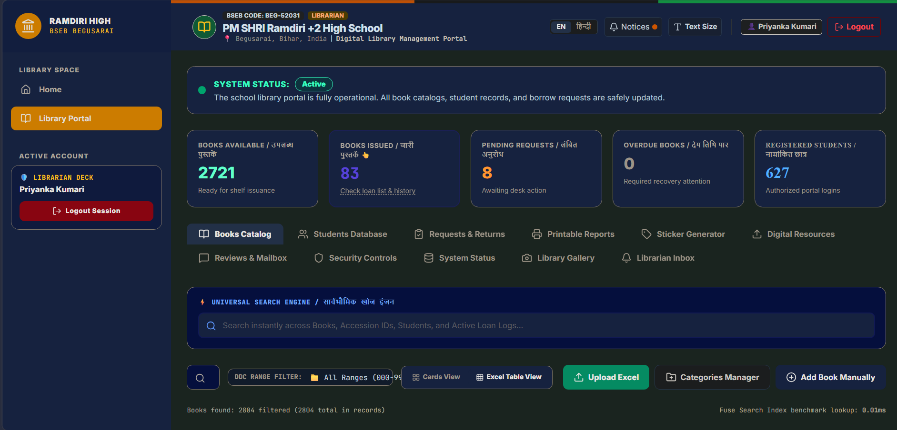
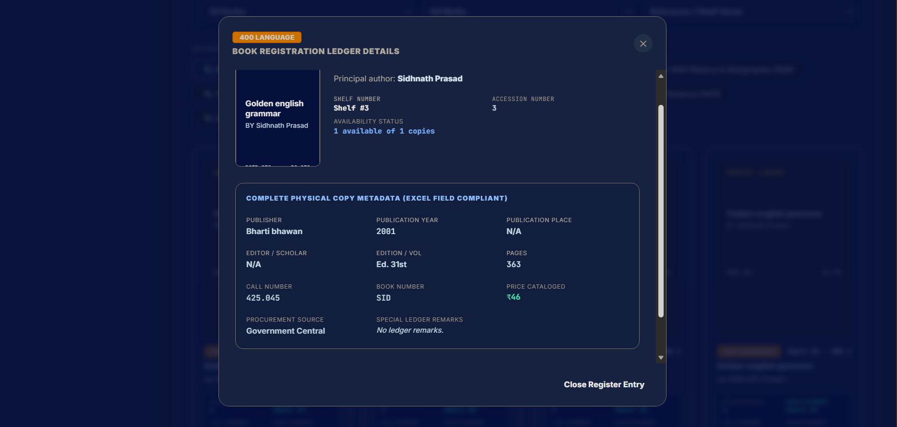
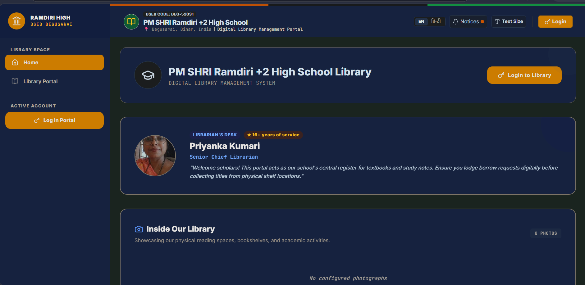
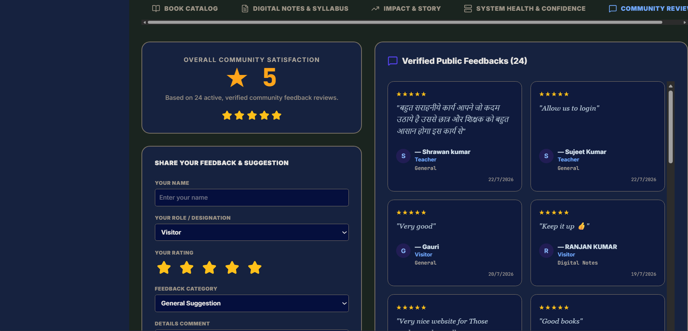

# Ramdiri Library Portal

A digital library management system built for PM SHRI Ramdiri +2 High School, Begusarai, Bihar.

The system digitizes the library's catalogue, lending workflow, student requests, book identification, and supporting resources while remaining practical for day-to-day use by students and a non-technical librarian.

**Status:** Production  
**Deployment:** July 2026

---

## Overview

The Ramdiri Library Portal was built to replace a largely paper-based library workflow with a searchable and operational digital system.

Before digitization, catalogue records, issue and return records, and student borrowing information were maintained through handwritten registers. This made it difficult to determine availability quickly, increased repetitive work for the librarian, and made routine record-keeping harder to maintain as the collection grew.

The portal provides students with direct access to the catalogue and availability information, while giving the librarian a central workspace for managing books, students, circulation, requests, reports, and library resources.

The system is designed around the actual workflow of the school rather than a generic library-management template.

---

## Preview

<p align="center">
  
</p>

<p align="center">
  
  
</p>

<p align="center">
  
</p>

---

## What the system handles

### Catalogue and Search

The catalogue supports detailed book records and search across fields such as:

- Title
- Author
- Publisher
- Category
- DDC classification
- Call number
- Shelf
- Accession number
- Book number

Search was designed for the way students actually enter queries rather than assuming exact spelling or exact language.

The search layer supports:

- English
- Devanagari Hindi
- Romanized Hindi
- Fuzzy matching
- Multi-field relevance scoring

This allows students to find books even when queries contain spelling variations, transliterated Hindi, or incomplete information.

---

### Book Circulation

The portal covers the main lending cycle:

- Book availability
- Student requests
- Librarian approval
- Issue processing
- Return processing
- Active loan tracking
- Return-status tracking

The student and librarian workflows are separated according to their respective responsibilities.

---

### Librarian Workspace

The librarian dashboard provides a central operational workspace for:

- Book catalogue management
- Student records
- Requests and returns
- Printable reports
- QR sticker generation
- Digital resources
- Feedback and moderation
- Security controls
- System status

Bulk spreadsheet import is also supported so that an existing school catalogue can be moved into the digital system without entering thousands of records manually.

The importer supports the school's existing spreadsheet structure as well as a compatible custom format, with validation performed before records are committed.

---

### QR-Based Book Identification

Each book can be associated with a QR code containing its library identification information.

The system generates print-ready sticker sheets for the library's physical books using the school's Oddy ST-24 label format.

The sticker workflow was tested against physical printed output rather than relying only on browser or PDF previews. Alignment, margins, QR placement, and metadata positioning required multiple rounds of adjustment to match the actual printer and label sheets used by the school.

This allows a normal smartphone camera to be used for book identification without requiring dedicated barcode-scanning hardware.

---

### Digital Resources

The portal also provides access to digital academic resources alongside the physical catalogue.

This keeps supporting study material connected to the same system instead of requiring students to search for it separately.

---

### Feedback and Community Input

The system includes a public feedback workflow with moderation support.

Feedback can be reviewed and managed through the librarian interface, allowing the school to collect suggestions and user experience information without giving unrestricted control over published content.

---

## Engineering Decisions

Several parts of the system were shaped by constraints discovered during real usage.

### Multilingual and fuzzy search

A basic exact-match search was not sufficient for the target users. Students may search using English, Hindi, Romanized Hindi, incomplete titles, spelling variations, or partial metadata.

The search system was therefore designed around fuzzy and multilingual matching instead of relying only on exact string comparison.

### QR codes instead of dedicated scanners

QR codes can be read using an ordinary smartphone camera, which avoids requiring additional scanning hardware.

The trade-off was that the print-generation workflow needed more careful calibration because the codes and metadata have to remain correctly positioned on physical sticker sheets.

### Bulk Excel import

Manual catalogue entry is impractical when migrating a large existing collection.

The import pipeline validates and maps spreadsheet records before committing them to the catalogue, reducing repetitive data entry and providing feedback when source records contain incomplete information.

### Synchronization

Production usage exposed synchronization issues that were not obvious during initial development.

For example, a librarian issuing a book needed that change to be reflected promptly when a student searched for the same book from another device.

The synchronization layer was revised to distinguish user-triggered updates from background refreshes and to coordinate catalogue, student, circulation, and request data updates.

### Performance

Search and page-load performance required active attention as the catalogue grew and the system was used over variable internet connections.

The system was designed to remain practical on modest devices and connections rather than assuming high-end hardware or consistently fast connectivity.

---

## Architecture

The application follows a multi-tier web architecture:

```text
Student / Librarian / Visitor
            |
            v
     React Frontend
            |
            v
      Express Backend
            |
     +------+------+
     |             |
Authentication   Business Logic
     |             |
     +------+------+
            |
            v
       MongoDB Atlas
